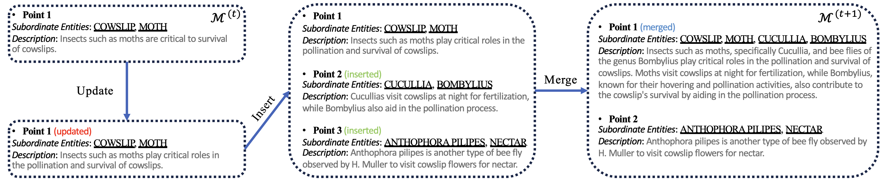
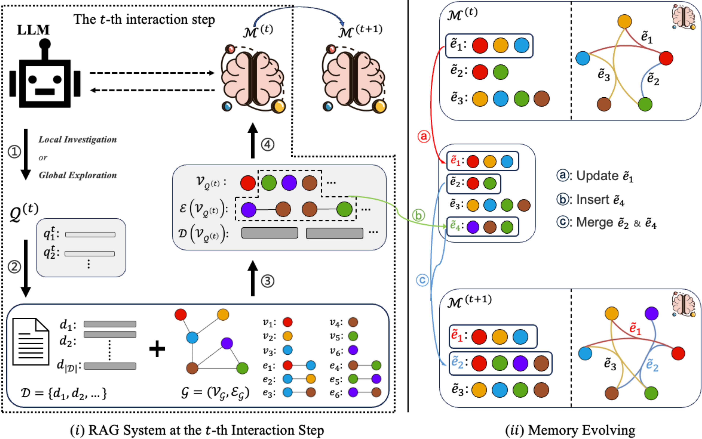

<h1 align="center">Improving Multi-step RAG with Hypergraph-based Memory For Long-context Complex Relational Modeling</h1>


[](https://arxiv.org/abs/2512.23959)
[](https://github.com/Encyclomen/HGMem)

### HGMem is a powerful working memory framework for LLMs that enhances their ability to perform sense-making questions by leveraging hypergraph-based memory structures to form high-order correlations.

Our experiments indicate that HGMem shows significant improvements over existing RAG methods in handling sense-making questions where answers can not be found directly from the documents.

Additionally, HGMem utlizes working memory that dynamically constructs hypergraph-based memory structures for specific questions, which allows it to better adapt to different question types and domains.


<p align="center">
  
</p>
<p align="center">
  <b>Figure 1:</b> The memory point and evolving example of HGMem
</p>

<p align="center">
  
</p>
<p align="center">
  <b>Figure 2:</b> HGMem methodology.
</p>

#### Check out our papers to learn more:

* [Improving Multi-step RAG with Hypergraph-based Memory for Long-Context Complex Relational Modeling](http://arxiv.org/abs/2512.23959)
----

## Installation

```sh
conda create -n hgmem python=3.11
conda activate hgmem
pip install -r requirements.txt
```
Initialize the environmental variables and activate the environment:

```sh
export CUDA_VISIBLE_DEVICES=0,1,2,3
export HF_HOME=<path to Huggingface home directory>

conda activate HGMem
```

## Quick Start
### Downloading Embedding Model
```sh
mkdir cache
cd cache
huggingface-cli download BAAI/bge-m3 --local-dir /path/to/save --local-dir-use-symlinks False
```
### API Usage (GPT-4o)

This simple example will illustrate how to use `HGMem` with any OpenAI API-based LLM.


1. Build Graph: 

```sh
export OPENAI_API_KEY="your_openai_api_key_here"
export OPENAI_BASE_URL="your_openai_base_url_here"

python build_graph.py --domains Long \
                      --source_texts narrative_qa \
                      --llm_model_name gpt-4o
                  
```

2. Run HGMem:
```sh
export OPENAI_API_KEY="your_openai_api_key_here"
export OPENAI_BASE_URL="your_openai_base_url_here"

python graph_run.py --domains Long \
                     --dataset narrative_qa \
                     --graph_mode single \
                     --rag_mode HGMem \
                     --source_type chunks100 \
                     --question_type traditional \
                     --llm_model_name gpt-4o
```

### Local Deployment (vLLM)

This simple example will illustrate how to use `HGMem` with any vLLM-compatible locally deployed LLM.

1. Run a local [vLLM server](https://docs.vllm.ai/en/latest/getting_started/quickstart.html#quickstart-online) with specified GPUs (leave enough memory for embedding model).

```sh
export CUDA_VISIBLE_DEVICES=0,1
export VLLM_WORKER_MULTIPROC_METHOD=spawn
export HF_HOME=<path to Huggingface home directory>

conda activate HGMem  # vllm should be in this environment

vllm serve Qwen2.5-32B --tensor-parallel-size 2 --max_model_len 4096 --gpu-memory-utilization 0.95 
```

2. Build Graph(adjust the llm_model_function in `build_graph.py` to use local vLLM): 

```sh
python build_graph.py --domains Long \
                      --source_texts narrative_qa \
                      --llm_model_name Qwen2.5-32b
```

3. Run HGMem(adjust the llm_model_function in `graph_run.py` to use local vLLM):
```sh
python graph_run.py --domains Long \
                     --dataset narrative_qa \
                     --graph_mode single \
                     --rag_mode HGMem \
                     --source_type chunks100 \
                     --question_type traditional \
                     --llm_model_name Qwen2.5-32b 
```


### Custom Datasets

To setup your own custom dataset for evaluation, follow the format and naming convention shown in `data/narrative_qa/domains/Long/0`. Organize your query corpus according to the query file `data/created_data/narrative_qa/domains/Long/0`, be sure to also follow our naming convention.

The corpus and optional query files should have the following format:

#### Retrieval Corpus JSON

```json
[
  [
    "he Project Gutenberg eBook, The Last Chronicle of Barset, by Anthony TrollopeThis eBook is for the use of anyone anywhere at no cost and with\nalmost no restrictions whatsoever.  You may copy it, rg.org"
  [
    "narrative",
    "test",
    "e0bc784c28ad8b8c"
  ]
  ],
  ...
]
```
#### Query JSONL

```json
{"question": "HOW DOES ADAM MORE ARRIVE IN THE \"LOST WORLD\"?", "reference_answer": [" THROUGH A VOLCANIC SUBTERRANEAN TUNNEL", "Shipwrecked"]}
{"question": "WHAT WAS ADAM MORE'S NATIONALITY?", "reference_answer": ["BRITISH", "British "]}
```


## Contact

Questions or issues? File an issue or contact 
[Chulun Zhou](mailto:clzhou@se.cuhk.edu.hk),
[Chunkang Zhang](mailto:zkang5051@gmail.com),
[Mo Yu](mailto:moyumyu@global.tencent.com),


## Citation

If you find this work useful, please consider citing our papers:

### HGMem 
```
@misc{zhou2025improvingmultistepraghypergraphbased,
      title={Improving Multi-step RAG with Hypergraph-based Memory for Long-Context Complex Relational Modeling}, 
      author={Chulun Zhou and Chunkang Zhang and Guoxin Yu and Fandong Meng and Jie Zhou and Wai Lam and Mo Yu},
      year={2025},
      eprint={2512.23959},
      archivePrefix={arXiv},
      primaryClass={cs.CL},
      url={https://arxiv.org/abs/2512.23959}, 
}
```

